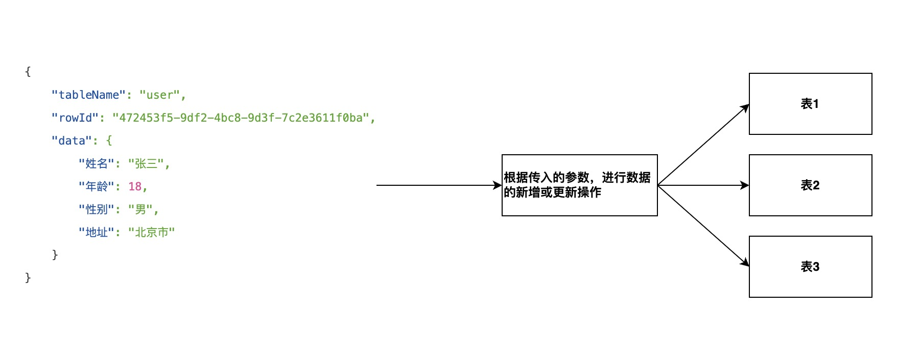

# 方案设计

## 1. 需求分析
如图所示，我们需要实现一个接口，该接口可以根据传入的参数，进行数据的新增或更新操作
 

比如，传入的参数为：
```json
{
    "tableName": "user",
    "rowId": "472453f5-9df2-4bc8-9d3f-7c2e3611f0ba",
    "data": {
        "姓名": "张三",
        "年龄": 18,
        "性别": "男",
        "地址": "北京市"
    }
}
```
根据`tableName`这个字段，判断出要操作的表为`user`表

根据`rowId`字段，判断是新增还是更新
- 如果有值，则为更新操作
- 如果没有值，则为新增操作

## 2. Openapi调用
下面只是例举某个工作表的调用方式，其他工作表的调用方式类似
### 2.1. 获取工作表结构
POST http://47.94.3.222:3168/api/v2/open/worksheet/getWorksheetInfo
```json
{
    "appKey": "88f51dc127d40d50",
    "sign": "ZjM4ZDE3MThiNGZhMzExMjMwNmFhZDZlZTZmZDZiMmNmMzBhNTNmYzhmZDBlZmVkNzM1N2YxNDkxZDdmY2Q4OQ==",
    "worksheetId": "yonghubiao"
}
```
返回值：
```json
{
    "data": {
        "worksheetId": "6673f1186722ad235933d4b5",
        "name": "用户表",
        "views": [
            {
                "viewId": "6673f1186722ad235933d4b9",
                "name": "全部"
            }
        ],
        "controls": [
            {
                "controlId": "6673f1186722ad235933d4b6",
                "controlName": "姓名",
                "type": 2,
                "attribute": 1,
                "row": 0,
                "col": 0,
                "hint": "",
                "default": "",
                "dot": 0,
                "unit": "",
                "enumDefault": 2,
                "enumDefault2": 0,
                "defaultMen": [],
                "dataSource": "",
                "sourceControlId": "",
                "sourceControlType": 0,
                "showControls": [],
                "noticeItem": 0,
                "userPermission": 0,
                "options": [],
                "required": true,
                "half": false,
                "relationControls": [],
                "viewId": "",
                "controlPermissions": "111",
                "unique": false,
                "coverCid": "",
                "strDefault": "",
                "desc": "",
                "fieldPermission": "",
                "advancedSetting": {
                    "sorttype": "en",
                    "analysislink": "1",
                    "min": "",
                    "max": "",
                    "isdecrypt": "0"
                },
                "alias": "",
                "size": 4,
                "editAttrs": [],
                "deleteAccountId": "",
                "deleteTime": "0001-01-01 08:00:00",
                "encryId": "",
                "sectionId": "",
                "remark": "",
                "lastEditTime": "0001-01-01 00:00:00",
                "disabled": false,
                "checked": false
            },
            {
                "controlId": "681329f8932f4474d825900b",
                "controlName": "性别",
                "type": 2,
                "attribute": 0,
                "row": 0,
                "col": 1,
                "hint": "",
                "default": "",
                "dot": 0,
                "unit": "",
                "enumDefault": 2,
                "enumDefault2": 0,
                "defaultMen": [],
                "dataSource": "",
                "sourceControlId": "",
                "sourceControlType": 0,
                "showControls": [],
                "noticeItem": 0,
                "userPermission": 0,
                "options": [],
                "required": true,
                "half": false,
                "relationControls": [],
                "viewId": "",
                "controlPermissions": "111",
                "unique": false,
                "coverCid": "",
                "strDefault": "",
                "desc": "",
                "fieldPermission": "",
                "advancedSetting": {
                    "sorttype": "en",
                    "analysislink": "1",
                    "min": "",
                    "max": "",
                    "isdecrypt": "0"
                },
                "alias": "",
                "size": 4,
                "editAttrs": [],
                "deleteAccountId": "",
                "deleteTime": "0001-01-01 08:00:00",
                "encryId": "",
                "sectionId": "",
                "remark": "",
                "lastEditTime": "0001-01-01 00:00:00",
                "disabled": false,
                "checked": false
            },
            {
                "controlId": "681329f8932f4474d825900c",
                "controlName": "年龄",
                "type": 6,
                "attribute": 0,
                "row": 0,
                "col": 2,
                "hint": "请填写数值",
                "default": "",
                "dot": 0,
                "unit": "",
                "enumDefault": 0,
                "enumDefault2": 0,
                "defaultMen": [],
                "dataSource": "",
                "sourceControlId": "",
                "sourceControlType": 0,
                "showControls": [],
                "noticeItem": 0,
                "userPermission": 0,
                "options": [],
                "required": false,
                "half": false,
                "relationControls": [],
                "viewId": "",
                "controlPermissions": "111",
                "unique": false,
                "coverCid": "",
                "strDefault": "",
                "desc": "",
                "fieldPermission": "",
                "advancedSetting": {
                    "showtype": "0",
                    "roundtype": "2",
                    "thousandth": "0",
                    "min": "",
                    "max": "",
                    "sorttype": "zh",
                    "numshow": "0",
                    "isdecrypt": "0"
                },
                "alias": "",
                "size": 4,
                "editAttrs": [],
                "deleteAccountId": "",
                "deleteTime": "0001-01-01 08:00:00",
                "encryId": "",
                "sectionId": "",
                "remark": "",
                "lastEditTime": "0001-01-01 00:00:00",
                "disabled": false,
                "checked": false
            },
            {
                "controlId": "681329f8932f4474d825900d",
                "controlName": "地址",
                "type": 2,
                "attribute": 0,
                "row": 1,
                "col": 0,
                "hint": "请填写文本内容",
                "default": "",
                "dot": 0,
                "unit": "",
                "enumDefault": 2,
                "enumDefault2": 0,
                "defaultMen": [],
                "dataSource": "",
                "sourceControlId": "",
                "sourceControlType": 0,
                "showControls": [],
                "noticeItem": 0,
                "userPermission": 0,
                "options": [],
                "required": false,
                "half": false,
                "relationControls": [],
                "viewId": "",
                "controlPermissions": "111",
                "unique": false,
                "coverCid": "",
                "strDefault": "",
                "desc": "",
                "fieldPermission": "",
                "advancedSetting": {
                    "analysislink": "1",
                    "sorttype": "en",
                    "min": "",
                    "max": "",
                    "isdecrypt": "0"
                },
                "alias": "",
                "size": 12,
                "editAttrs": [],
                "deleteAccountId": "",
                "deleteTime": "0001-01-01 08:00:00",
                "encryId": "",
                "sectionId": "",
                "remark": "",
                "lastEditTime": "0001-01-01 00:00:00",
                "disabled": false,
                "checked": false
            }
        ]
    },
    "success": true,
    "error_code": 1
}
```
### 2.2. 新增数据
POST http://47.94.3.222:3168/api/v2/open/worksheet/addRow
```json
{
  "appKey": "88f51dc127d40d50",
  "sign": "ZjM4ZDE3MThiNGZhMzExMjMwNmFhZDZlZTZmZDZiMmNmMzBhNTNmYzhmZDBlZmVkNzM1N2YxNDkxZDdmY2Q4OQ==",
  "worksheetId": "yonghubiao",
  "triggerWorkflow": true,
  "controls": [
    {
      "controlId": "6673f1186722ad235933d4b6",
      "value": "文本"
    },
    {
      "controlId": "681329f8932f4474d825900b",
      "value": "文本"
    },
    {
      "controlId": "681329f8932f4474d825900c",
      "value": "666.66"
    },
    {
      "controlId": "681329f8932f4474d825900d",
      "value": "文本"
    }
  ]
}
```
### 2.3. 更新数据
POST http://47.94.3.222:3168/api/v2/open/worksheet/editRow
```json
{
  "appKey": "88f51dc127d40d50",
  "sign": "ZjM4ZDE3MThiNGZhMzExMjMwNmFhZDZlZTZmZDZiMmNmMzBhNTNmYzhmZDBlZmVkNzM1N2YxNDkxZDdmY2Q4OQ==",
  "worksheetId": "yonghubiao",
  "triggerWorkflow": true,
  "controls": [
    {
      "controlId": "6673f1186722ad235933d4b6",
      "value": "文本"
    },
    {
      "controlId": "681329f8932f4474d825900b",
      "value": "文本"
    },
    {
      "controlId": "681329f8932f4474d825900c",
      "value": "666.66"
    },
    {
      "controlId": "681329f8932f4474d825900d",
      "value": "文本"
    }
  ],
  "rowId": "行记录ID"
}
```

## 3. 实现思路
### 3.1. 实现步骤
1. 根据传入的参数，判断出要操作的表为`user`表
   这里需要有个映射表，将`tableName`映射为`worksheetId`；此外还需要有个映射表，维护`worksheetId`和`appId`的关系，因为，不同的`appId`对应的`appKey`和`sign`是不同的
   映射表手动维护
   如果没有获取到映射值，则返回错误信息
2. 调用Openapi获取工作表结构
   获取到`worksheetId`后，调用Openapi获取工作表结构
   这里需要有个缓存，避免每次都调用Openapi，缓存时间可以设置为1小时
   如果获取失败，则返回错误信息
3. 根据`rowId`字段，判断是新增还是更新
   如果有值，则为更新操作
   如果没有值，则为新增操作
4. 调用Openapi新增
   根据第2步获取到的工作表结构，结合传入参数的data字段，构造Openapi的请求参数
   如果新增失败，则返回错误信息
   如果新增成功，则返回成功信息，成功信息中包含新增的行记录ID
5. 调用Openapi更新
   根据第2步获取到的工作表结构，结合传入参数的data字段，构造Openapi的请求参数
   如果更新失败，则返回错误信息
   如果更新成功，则返回成功信息
6. 返回结果
   返回的结果满足以下格式
```json
// 新增成功
{
    "success": true,
    "error_code": 1,
    "data": {
        "rowId": "行记录ID"
    }
}
// 更新成功
{
    "success": true,
    "error_code": 1
}
// 新增或更新失败
{
    "success": false,
    "error_code": 0,
    "error_msg": "错误信息"
}
```
### 3.2. 代码实现要求
1. 代码必须要专业
2. 在src目录下实现功能
3. 在根目录创建一个文件`log/codelog.txt`，记录做出的更改
4. 使用NodeJS实现，接口的调用方式为 
   POST http://127.0.0.1:3168/insertOrUpdate
   传入参数为 JSON
5. 代码创建完成后，自动启动，过程中如果遇到问题，告知我进行解决